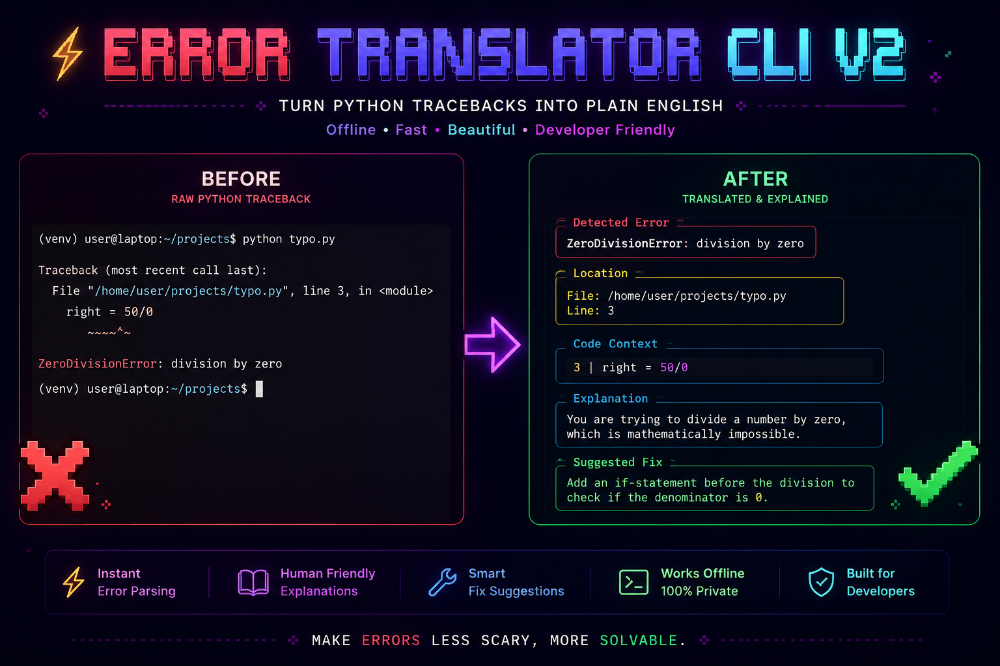

# Error Translator

<div align="left">
  <a href="https://pypi.org/project/error-translator-cli-v2/"></a>
  
  <a href="https://github.com/gourabanandad/error-translator-cli-v2/stargazers"></a>
  <a href="https://pypi.org/project/error-translator-cli-v2/"></a>
  <a href="https://github.com/gourabanandad/error-translator-cli-v2"></a>
  <a href="https://github.com/gourabanandad/error-translator-cli-v2/actions/workflows/ci.yml"></a>
</div>

<br>



<br>

**Error Translator** is an offline Python traceback translator and exception explainer that converts raw errors into crystal-clear explanations and immediately actionable fixes. Built for local-first development workflows, it supports direct CLI usage, an automatic import hook, a programmatic Python API, and a FastAPI integration.

If this project saves you debugging time, please consider starring it on GitHub: https://github.com/gourabanandad/error-translator-cli-v2

## Why Developers Like It

* **Fast Feedback Loop**: Turn stack traces into direct next actions in seconds.
* **Works Offline**: No telemetry dependency for core translation behavior.
* **Beginner-Friendly Output**: Explanations are clear enough for learners, practical enough for teams.
* **Multiple Entry Points**: CLI, import hook, Python API, and FastAPI all share one deterministic engine.

## Key Features

* **CLI-First Architecture**: Seamlessly process scripts, direct error strings, or piped logs via the `explain-error` command.
* **Professional Rich Terminal UI**: Clean panels, syntax-highlighted code context, structured sections, and improved readability for day-to-day debugging.
* **Automatic Integration Mode**: Inject the module via `import error_translator.auto` to automatically override `sys.excepthook` for graceful, translated crash reporting.
* **Extensible API Surfaces**: Integrate natively within Python or expose the core engine over HTTP via the included FastAPI server.
* **Deterministic Rules Engine**: High-performance, regex-based matching powered by `rules.json` guarantees offline and privacy-first translations.
* **Optional Native Acceleration**: A C extension matcher (`fast_matcher`) can accelerate rule scanning, with automatic fallback to pure Python when unavailable.
* **Optional AST Insight Hooks**: Registered handlers can append targeted hints (`ast_insight`) for selected error types.

## Installation

Python requirement: **3.9 or newer**.

Install the latest stable release directly from PyPI:

```bash
pip install error-translator-cli-v2
```

Verify the installation:

```bash
explain-error --version
```

## Usage Guide

### 1. Command-Line Interface (CLI)

Run a Python script and catch any unhandled exceptions:
```bash
explain-error run script.py
```

Provide an error string directly:
```bash
explain-error "NameError: name 'usr_count' is not defined"
```

Pipe system or Docker logs into the engine:
```bash
cat error.log | explain-error
```

Emit structured JSON for scripting and automation:
```bash
explain-error --json "NameError: name 'x' is not defined"
# {"explanation": "...", "fix": "...", "matched_error": "...", "file": "...", "line": "...", "code": "...", "ast_insight": null}
```

Show an about screen with project metadata and quick usage examples:
```bash
explain-error --about
```

The `--json` flag works with every input mode (`run <script>`, raw string, piped log).

### 2. Automatic Import Hook

Catch and translate unhandled exceptions globally by importing the module:

```python
import error_translator.auto

def main():
    # This TypeError will automatically trigger the error translator
    total = "Users: " + 42

if __name__ == "__main__":
    main()
```

### 3. Jupyter Integration

Load the Error Translator as a Jupyter extension to automatically translate exceptions in your notebooks:

```python
%load_ext error_translator.jupyter
```

Any unhandled exception in subsequent cells will display:
- The standard Jupyter traceback (for reference)
- A formatted translation with explanation and suggested fix
- AST-based insights (when applicable)

This integrates seamlessly with Jupyter notebooks and JupyterLab, allowing you to debug interactively with clear, actionable error explanations.

### 4. FastAPI Service

Start the built-in HTTP server for remote translation services:

```bash
uvicorn error_translator.api.server:app --host 127.0.0.1 --port 8000 --reload
```

Submit a traceback payload via the exposed REST API:

```bash
curl -X POST http://127.0.0.1:8000/translate \
  -H "Content-Type: application/json" \
  -d "{\"traceback_setting\":\"Traceback (most recent call last):\\n  File 'app.py', line 14, in <module>\\n    total = 'Users: ' + 42\\nTypeError: can only concatenate str (not 'int') to str\"}"
```

Additional endpoints:

- `GET /health` returns service status.
- `GET /` serves the bundled web UI from `error_translator/api/static/index.html`.

### 5. Optional C Extension Build

The translation engine automatically attempts to import `error_translator.fast_matcher`.
If it is not built or not available on the platform, Error Translator falls back to the pure Python regex loop with no behavior change.

Build the extension in-place from the repository root:

```bash
python setup_ext.py build_ext --inplace
```

This step is optional and intended for local performance optimization.

## Documentation

Detailed documentation is located in the [`docs/`](docs/) directory:

- [**Real-World Examples**](docs/examples.md): Practical demonstrations comparing raw tracebacks with their translated counterparts.
- [**Architecture & Internals**](docs/ARCHITECTURE.md): Comprehensive teardown of the regex engine, AST integration, and internal design philosophy.
- [**Contributing Guidelines**](docs/CONTRIBUTING.md): Standards, PR checklists, and instructions for utilizing our AI-Powered Rule Builder.

## Maintainers

This project is actively developed and maintained by **Gourabananda Datta** alongside our open-source contributors.
