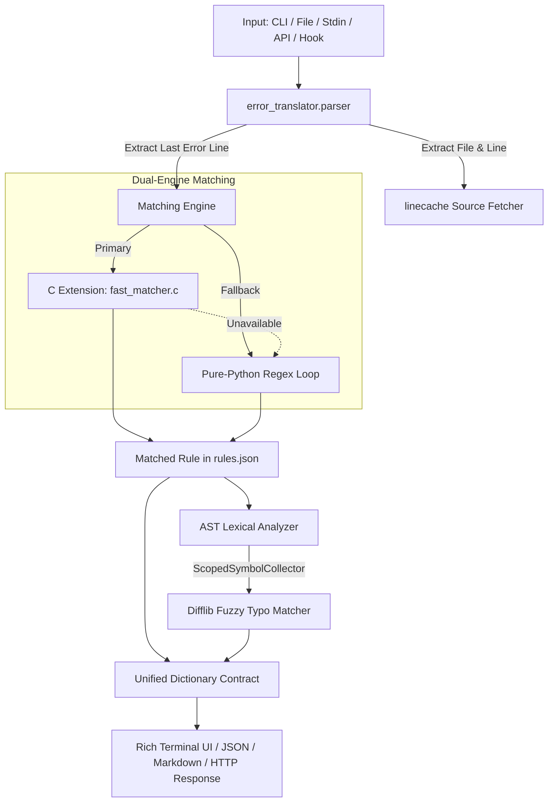

# Error Translator CLI v2

<div align="center">

  [](https://pypi.org/project/error-translator-cli-v2/)
  [](https://pypi.org/project/error-translator-cli-v2/)
  [](https://github.com/gourabanandad/error-translator-cli-v2/actions)
  [](https://opensource.org/licenses/MIT)
  [](https://github.com/astral-sh/ruff)
  [](#why-developers-choose-error-translator)

</div>

<br>

<div align="center">
  
</div>

<br>

<div align="center">
  <h3>Deterministic Python Traceback Analysis and Exception Diagnostics</h3>
  <p><b>100% Offline • Deterministic • Sub-millisecond Execution • AST Lexical Scoping • Multi-Surface Integration</b></p>
</div>

<div align="center">
  <a href="https://gourabanandad.github.io/error-translator-cli-v2/"><b>Official Documentation</b></a> •
  <a href="#quickstart"><b>Quickstart</b></a> •
  <a href="#integration-surfaces"><b>Integration Surfaces</b></a> •
  <a href="#cli-command-reference"><b>CLI Reference</b></a> •
  <a href="#python-programmatic-api"><b>Python API</b></a> •
  <a href="#contributing"><b>Contributing</b></a>
</div>

<br>

---

## Overview

**Error Translator** is a deterministic, offline-first traceback analyzer and exception explainer designed for Python developers, educators, and CI/CD pipelines.

Instead of navigating obscure call stacks and cryptic exception strings, Error Translator analyzes the traceback, extracts the crashing line from source files, inspects local AST lexical scopes, and outputs **structured diagnostic panels** alongside **concrete remediation steps**.

```text
--------------------------------------------------------------------------------
RAW TRACEBACK:
Traceback (most recent call last):
  File "app.py", line 14, in <module>
    total = "Users: " + user_cnt
NameError: name 'user_cnt' is not defined. Did you mean: 'user_count'?

ERROR TRANSLATOR OUTPUT:
┌─ Detected Error ─────────────────────────────────────────────────────────────┐
│ NameError: name 'user_cnt' is not defined                                    │
├─ Location ───────────────────────────────────────────────────────────────────┤
│ File: app.py  |  Line: 14                                                    │
├─ Code Context ───────────────────────────────────────────────────────────────┤
│ 14 │ total = "Users: " + user_cnt                                            │
├─ Explanation ────────────────────────────────────────────────────────────────┤
│ You tried to use a variable or function named 'user_cnt', but Python doesn't │
│ recognize it in the current scope.                                           │
├─ Suggested Fix ──────────────────────────────────────────────────────────────┤
│ Check if 'user_cnt' is spelled correctly, or define/import it first.         │
├─ AST Insight ────────────────────────────────────────────────────────────────┤
│ Did you mean 'user_count'? There appears to be a typo.                       │
└──────────────────────────────────────────────────────────────────────────────┘
```

---

## Comparison

| Feature | Error Translator | Default Python Tracebacks | Cloud LLM APIs |
| :--- | :---: | :---: | :---: |
| **Privacy & Security** | **100% Offline (Zero egress)** | Offline | Code sent over network |
| **Translation Latency** | **< 1 millisecond** | Instant | 1,000 – 4,000 ms |
| **API Cost & Rate Limits** | **Free ($0.00)** | Free | Token consumption costs |
| **Actionable Guidance** | **Direct solutions & fixes** | Raw exception text only | Variable quality |
| **AST Lexical Intelligence** | **Scope-aware typo checks** | Not available | Prone to hallucination |
| **Multi-Surface Usability** | **CLI, REPL, API, Jupyter, Hook** | Terminal only | Browser / Chat only |

- **Zero Telemetry & 100% Offline**: All regex pattern matching and AST traversals execute strictly on your local machine. No data leaves your workstation.
- **Dual Matching Engine**: Uses a pre-compiled native C extension (`fast_matcher.c`) with automatic, transparent fallback to pure Python for cross-platform compatibility.
- **Lexical-Scope AST Analysis**: Inspects Python syntax trees bounded by function and class line ranges to provide accurate identifier suggestions without scope bleeding.
- **Multi-Surface Integration**: Accessible from the terminal CLI, an interactive REPL, an automatic `sys.excepthook`, a Python module, Jupyter notebooks, or a FastAPI microservice.

---

## Installation

Error Translator requires **Python 3.9** or newer.

```bash
# Standard installation (CLI, Python API, Auto Hook)
pip install error-translator-cli-v2

# With Jupyter / IPython extension support
pip install "error-translator-cli-v2[jupyter]"

# With FastAPI REST server & Web dashboard
pip install "error-translator-cli-v2[server]"

# Full installation (all features)
pip install "error-translator-cli-v2[server,jupyter,dev,docs]"
```

Verify your installation:

```bash
explain-error --version
```

---

## Quickstart

### 1. Run a Python script directly
Run your script through `explain-error`. If it succeeds, stdout is passed through untouched. If it crashes, the traceback is intercepted and translated:

```bash
explain-error run script.py
# Or use shorthand:
explain-error script.py
```

### 2. Translate raw error strings
Pass error strings directly from your terminal or clipboard:

```bash
explain-error "TypeError: can only concatenate str (not 'int') to str"
```

### 3. Pipe log files or Docker outputs
Feed standard input directly into the CLI:

```bash
cat server_crash.log | explain-error
docker logs my_container 2>&1 | explain-error
```

### 4. Interactive REPL Mode
Start an interactive debugging shell to translate single-line errors or pasted multi-line tracebacks without restarting the tool:

```bash
explain-error interactive
```

---

## Integration Surfaces

### A. Automatic Exception Hook (`error_translator.auto`)

Automatically intercept every unhandled crash in your script and render translated advice before program exit without changing your application code:

```python
# Place this at the very top of your entrypoint (e.g., main.py)
import error_translator.auto


def calculate_average(items):
    # This will trigger a ZeroDivisionError
    return sum(items) / len(items)


calculate_average([])
```

### B. Programmatic Python API

Integrate traceback translation into your logging systems, error-monitoring workers, Discord/Slack webhooks, or test frameworks:

```python
from error_translator import translate_error

traceback_payload = """
Traceback (most recent call last):
  File "calculator.py", line 8, in divide
    return a / b
ZeroDivisionError: division by zero
"""

result = translate_error(traceback_payload)

print(result["matched_error"])  # 'ZeroDivisionError: division by zero'
print(result["explanation"])  # 'You are trying to divide a number by zero...'
print(result["fix"])  # 'Add an if-statement before the division...'
print(result["file"])  # 'calculator.py'
print(result["line"])  # '8'
```

### C. Jupyter Notebook & Lab Magic (`%load_ext`)

Enable in-cell crash translations across Jupyter Notebooks, JupyterLab, Google Colab, and VS Code Notebooks:

```python
# In your first notebook cell:
%load_ext error_translator.jupyter

# In any subsequent cell:
data = {"user": "Alice", "score": 98}
print(data["email"])  # KeyError: 'email'
```

> **Result:** The cell displays the standard Jupyter traceback followed immediately by a clean Markdown panel containing the translated explanation, suggested fix, and AST suggestions.

### D. FastAPI REST Microservice & Web Dashboard

Launch the embedded FastAPI server to provide translation capabilities across distributed networks, CI/CD runners, or web frontends:

```bash
uvicorn error_translator.api.server:app --host 127.0.0.1 --port 8000 --reload
```

- **Interactive Web UI**: Open `http://127.0.0.1:8000/` in your browser.
- **Translate Single Error**:
  ```bash
  curl -X POST http://127.0.0.1:8000/translate \
    -H "Content-Type: application/json" \
    -d '{"traceback_setting": "IndexError: list index out of range"}'
  ```
- **Translate Batch Errors (Concurrent)**:
  ```bash
  curl -X POST http://127.0.0.1:8000/translate/batch \
    -H "Content-Type: application/json" \
    -d '{"tracebacks": ["KeyError: \"id\"", "ZeroDivisionError: division by zero"]}'
  ```
- **Health Check**: `GET http://127.0.0.1:8000/health`

---

## CLI Command Reference

The CLI entry point is `explain-error`.

```text
Usage: explain-error [OPTIONS] [COMMAND / ARGS]...

Commands & Arguments:
  run <script.py>       Execute a target script and translate tracebacks if it fails.
  interactive           Launch an interactive REPL for one-off and multi-line pastes.
  <path.py>             Direct shorthand to execute a Python file.
  <path.log>            Read a saved log file and translate the recorded exception.
  "<traceback text>"    Translate raw string arguments directly.
  stdin (pipe)          Stream logs via stdin (e.g., cat error.log | explain-error).

Options:
  --json                Output pure, single-line JSON instead of styled Rich UI.
  -a, --about           Show developer metadata, runtime info, and environment diagnostics.
  -v, --version         Show package version, Python version, and C-extension build status.
  -h, --help            Render the interactive command palette and documentation overview.
```

### JSON Automation Mode (`--json`)

Any command mode can be paired with `--json` for seamless piping into `jq`, log aggregators, or automated CI failure triage:

```bash
explain-error --json "KeyError: 'token'" | jq .explanation
```

```json
{
  "explanation": "You tried to look up a key named 'token' in a dictionary, but that key doesn't exist.",
  "fix": "Check for typos in the key name, or use the .get('token') method to safely access dictionary values.",
  "ast_insight": null,
  "matched_error": "KeyError: 'token'",
  "file": "Unknown File",
  "line": "Unknown Line",
  "code": ""
}
```

---

## Python Programmatic API Specification

Calling `translate_error(traceback_text: str) -> dict` produces a dictionary with the following schema contract:

| Key | Type | Description |
| :--- | :--- | :--- |
| `explanation` | `str` | Plain-English explanation of why this error occurs. |
| `fix` | `str` | Step-by-step actionable remedy with relevant code suggestions. |
| `matched_error` | `str` | The exact exception line extracted from the traceback. |
| `file` | `str` | Path to the source file where the exception occurred (`Unknown File` if unavailable). |
| `line` | `str` | Line number where the crash originated (`Unknown Line` if unavailable). |
| `code` | `str` | Extracted source line read via `linecache` (empty string if unavailable). |
| `ast_insight` | `str \| None` | Lexical AST analysis suggestions (e.g., `"Did you mean 'target'?"`) when applicable. |

---

## Comprehensive Error Coverage

Error Translator includes **56+ deterministic rule patterns** across **26+ standard Python exception classes**:

| Exception Category | Python Exception Classes | Common Search Queries & Patterns |
| :--- | :--- | :--- |
| **Lookup & Scoping** | `NameError`, `UnboundLocalError`, `AttributeError` | `name 'x' is not defined`, `local variable referenced before assignment`, `object has no attribute` |
| **Types & Values** | `TypeError`, `ValueError` | `can only concatenate str to str`, `unsupported operand type(s)`, `invalid literal for int() with base 10` |
| **Collections & Mappings** | `IndexError`, `KeyError`, `StopIteration` | `list index out of range`, `dictionary key not found`, `StopIteration in generator` |
| **Imports & Packages** | `ModuleNotFoundError`, `ImportError` | `No module named 'pkg'`, `cannot import name 'fn' from 'mod'` |
| **Filesystem & OS** | `FileNotFoundError`, `PermissionError`, `IsADirectoryError`, `FileExistsError`, `OSError` | `[Errno 2] No such file or directory`, `[Errno 13] Permission denied`, `File exists` |
| **Syntax & Indentation** | `SyntaxError`, `IndentationError`, `TabError` | `invalid syntax`, `unexpected EOF while parsing`, `expected an indented block`, `inconsistent use of tabs and spaces` |
| **Arithmetic & Math** | `ZeroDivisionError`, `OverflowError`, `FloatingPointError` | `division by zero`, `math range error`, `overflow during calculation` |
| **Runtime & Recursion** | `RecursionError`, `MemoryError`, `TimeoutError`, `NotImplementedError`, `AssertionError` | `maximum recursion depth exceeded`, `out of memory RAM limit`, `assert statement failed` |

---

## Keywords & Search Topics

- **Core Capabilities**: Python error translator, Python traceback analyzer, Python exception explainer, stack trace parser, human-readable error messages, offline Python debugger, CLI error explainer.
- **AST Typo Analysis**: Python AST lexical scope analyzer, `NameError` typo suggestion, `AttributeError` method suggester, difflib fuzzy symbol matching.
- **Supported Environments**: Terminal CLI, interactive REPL, `sys.excepthook` auto hook, IPython / Jupyter notebook extension, FastAPI REST API microservice.

---

## Architectural Highlights


```mermaid
flowchart TD
    A[Input: CLI / File / Stdin / API / Hook] --> B[error_translator.parser]
    B -->|Extract File & Line| C[linecache Source Fetcher]
    B -->|Extract Last Error Line| D[Matching Engine]
    
    subgraph Engine [Dual-Engine Matching]
        D -->|Primary| E[C Extension: fast_matcher.c]
        D -->|Fallback| F[Pure-Python Regex Loop]
        E -.->|Unavailable| F
    end
    
    E --> G[Matched Rule in rules.json]
    F --> G
    
    G --> H[AST Lexical Analyzer]
    H -->|ScopedSymbolCollector| I[Difflib Fuzzy Typo Matcher]
    
    G --> J[Unified Dictionary Contract]
    I --> J
    
    J --> K[Rich Terminal UI / JSON / Markdown / HTTP Response]
```

- **Dual-Engine Acceleration**: If compiled, the C extension scans regex patterns in native memory. If not present, the engine transparently runs standard `re` matching with identical outputs.
- **Zero-Pollution AST Scoping**: The `ScopedSymbolCollector` inspects AST node boundaries (`lineno` and `end_lineno`). It visits function/class interiors only if the crash occurred inside that specific block.

---

## Development & Rule Generation Tooling

Error Translator includes toolchains for scraping standard library errors and synthesizing rule patterns:

```bash
# 1. Scrape standard library error patterns
python scripts/scraper.py

# 2. Run the interactive rule builder
export GEMINI_API_KEY="your_api_key"
python scripts/builder.py
```

Run test suite locally:

```bash
# Using uv (fastest)
uv run pytest

# Or with standard pytest
pytest
```

---

## Documentation

Explore the full documentation suite on the [Official Documentation Site](https://gourabanandad.github.io/error-translator-cli-v2/):

- [**Features & Integrations Guide**](docs/features.md) — Comprehensive guide on all CLI commands, Jupyter magic, REPL workflows, and FastAPI endpoints.
- [**Architecture & Internals**](docs/ARCHITECTURE.md) — Detailed teardown of the regex engine, AST parser, C-extension lifecycle, and data contracts.
- [**Real-World Examples Catalog**](docs/examples.md) — Side-by-side comparisons of raw tracebacks vs. Error Translator outputs.
- [**Contributing Guidelines**](docs/CONTRIBUTING.md) — Step-by-step instructions for adding rules, writing tests, and opening PRs.
- [**Changelog**](CHANGELOG.md) — Full release history and version tracking.

---

## License & Author

Created and maintained by **[Gourabananda Datta](https://github.com/gourabanandad)**.

Distributed under the **[MIT License](LICENSE)**. Contributions, bug reports, and feature suggestions are always welcome!
