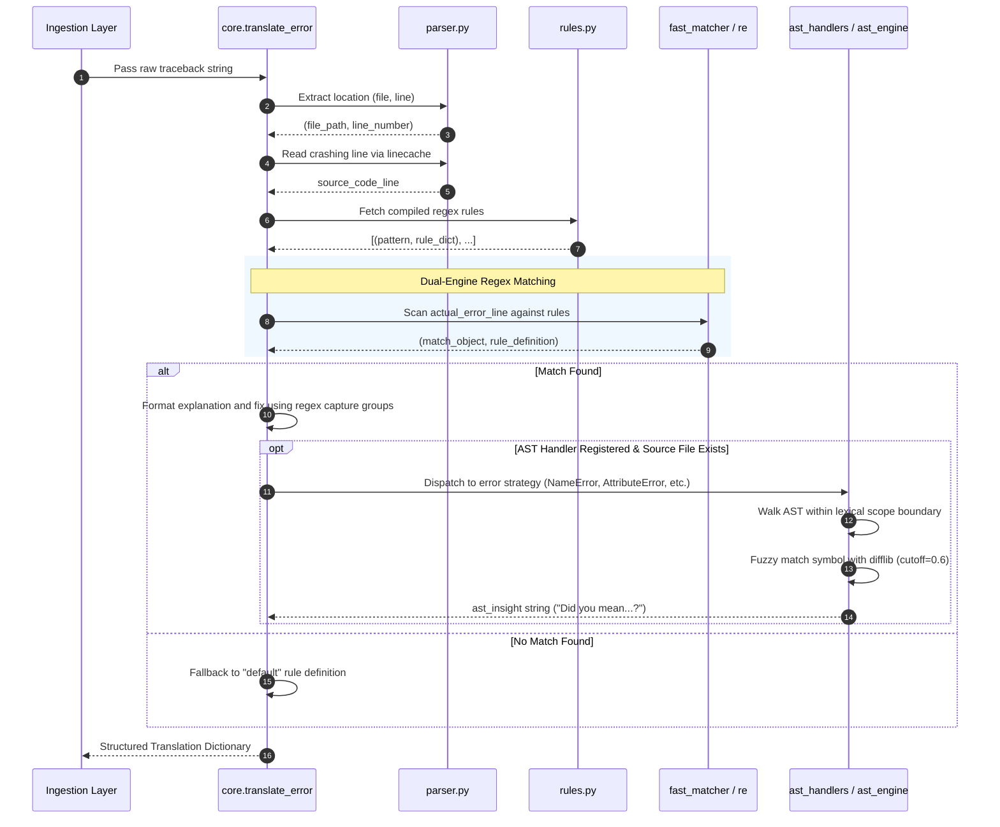
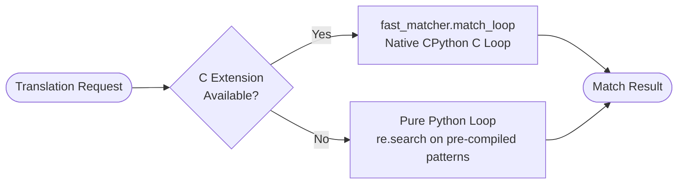
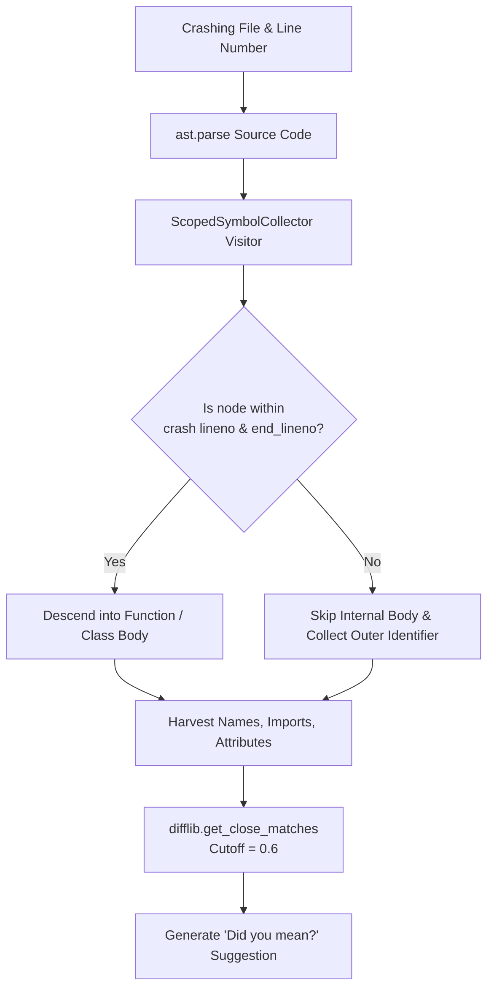

# Architecture & Internals

**Error Translator** is engineered as a high-performance, local-first Python library and CLI tool. It utilizes a deterministic rule-matching pipeline, Abstract Syntax Tree (AST) lexical inspection, and an optional native C extension to deliver instant, human-readable error explanations without network dependencies or AI latency.

---

## 1. System Topology & Architecture Overview

The system is decoupled into presentation layers, orchestration pipelines, parsing utilities, and diagnostic engines. All interfaces share the exact same deterministic core engine (`error_translator.core`).

```mermaid
flowchart TB
    subgraph Inputs [Integration Surfaces]
        CLI["CLI Tool (explain-error)"]
        REPL["Interactive REPL"]
        HOOK["Auto Hook (sys.excepthook)"]
        JUPYTER["Jupyter (%load_ext)"]
        API["FastAPI REST Server"]
    end

    subgraph CorePipeline [Core Translation Pipeline (core.py)]
        PARSER["Parser (parser.py)<br/>• extract_location()<br/>• linecache source reader"]
        RULES["Rule Manager (rules.py)<br/>• load_rules() [LRU Cache]<br/>• compiled_rules() [LRU Cache]"]
        
        subgraph Engine [Dual-Engine Matcher]
            C_EXT["Native C Extension<br/>(fast_matcher.c)"]
            PY_LOOP["Pure Python Loop<br/>(re.search)"]
        end
        
        AST_ROUTER["AST Router (ast_handlers.py)<br/>• AST_REGISTRY Dispatch"]
        AST_ENGINE["AST Engine (ast_engine.py)<br/>• ScopedSymbolCollector<br/>• difflib Fuzzy Typo Matcher"]
    end

    subgraph Outputs [Presentation & Formatting]
        UI_RICH["Rich Terminal UI (ui.py)"]
        UI_JSON["JSON Serializer"]
        UI_MD["IPython Markdown"]
        UI_HTTP["REST JSON / Web Dashboard"]
    end

    CLI --> PARSER
    REPL --> PARSER
    HOOK --> PARSER
    JUPYTER --> PARSER
    API --> PARSER

    PARSER --> Engine
    RULES --> Engine
    
    Engine -->|Primary| C_EXT
    Engine -.->|Fallback if C unavailable| PY_LOOP
    
    C_EXT --> AST_ROUTER
    PY_LOOP --> AST_ROUTER
    
    AST_ROUTER --> AST_ENGINE
    
    AST_ENGINE --> UI_RICH
    AST_ENGINE --> UI_JSON
    AST_ENGINE --> UI_MD
    AST_ENGINE --> UI_HTTP
```

---

## 2. Translation Pipeline Lifecycle

Every call to `translate_error(traceback_text: str)` executes through a strict, deterministic sequence:



### Lifecycle Step Breakdown:

1. **Traceback Ingestion**: Non-empty lines from the input string are extracted. The final line represents the runtime error message (e.g., `ValueError: invalid literal for int() with base 10: 'abc'`).
2. **Location & Code Extraction**:
   - `extract_location()` uses regular expressions to capture the file path and line number from standard `File "...", line N` frames.
   - `extract_code_context()` utilizes Python's built-in `linecache` to fetch the source line from disk without loading the entire file into memory.
3. **Dual Matching Execution**:
   - The compiled regex list is passed to `fast_matcher.match_loop` (C Extension).
   - If `fast_matcher` is not available, the engine iterates through `compiled_rules()` in pure Python.
4. **Pattern Variable Injection**: Dynamic variables captured by regex groups (`(.*)`) are formatted into the template `explanation` and `fix` strings via `{0}`, `{1}`, etc.
5. **AST Lexical Analysis**: If an AST handler is registered for the specific error class (`AST_REGISTRY`) and the source file is reachable, the AST scoping engine executes to detect typos or missing symbols.
6. **Unified Dictionary Assembly**: Returns a dictionary conforming to the standard runtime contract.

---

## 3. Module Breakdown & Responsibilities

| Module | Location | Primary Responsibility |
| :--- | :--- | :--- |
| **`core`** | `src/error_translator/core.py` | Orchestrates the translation pipeline, matching engine, and AST dispatch. |
| **`parser`** | `src/error_translator/parser.py` | Parses stack trace strings for filenames and line numbers; reads source lines using `linecache`. |
| **`rules`** | `src/error_translator/rules.py` | Reads `rules.json`, caches parsed JSON, and pre-compiles `re.Pattern` objects with `functools.lru_cache`. |
| **`ast_engine`** | `src/error_translator/ast/ast_engine.py` | Traverses Python ASTs with `ScopedSymbolCollector` and computes string similarities using `difflib`. |
| **`ast_handlers`** | `src/error_translator/ast/ast_handlers.py` | Strategy registry (`AST_REGISTRY`) mapping error types (`NameError`, `AttributeError`, `ImportError`) to AST analyzers. |
| **`cli`** | `src/error_translator/cli.py` | CLI entry point (`explain-error`), argument parsing, interactive REPL loop, and first-run welcome logic. |
| **`runner`** | `src/error_translator/runner.py` | Subprocess executor for running target Python scripts and capturing `stderr` on crash. |
| **`ui`** | `src/error_translator/ui.py` | Presentation layer using Rich panels, syntax highlighting, version metadata, and JSON output serializers. |
| **`auto`** | `src/error_translator/auto.py` | Exception hook module overriding `sys.excepthook` for automatic runtime crash translation. |
| **`jupyter`** | `src/error_translator/jupyter.py` | IPython extension module registering `set_custom_exc` for Jupyter cell crash translation. |
| **`server`** | `src/error_translator/api/server.py` | FastAPI REST microservice exposing single (`/translate`) and concurrent batch (`/translate/batch`) endpoints. |
| **`fast_matcher`** | `src/error_translator/ext/fast_matcher.c` | Native CPython extension providing low-level C loop acceleration for regex rule scanning. |

---

## 4. Dual Matching Engine (C Extension & Fallback)

To provide optimal throughput in automated environments, Error Translator implements a hybrid C / Python architecture.



### Native C Extension (`fast_matcher.c`)
- Written using the CPython C-API.
- Bypasses Python bytecode iteration overhead by evaluating regex matches (`PyObject_CallMethod`) directly in native C.
- Includes strict exception hygiene: calls `PyErr_Clear()` before iterating to prevent pending exceptions from leaking between rule checks.
- Optional during build: configured with `optional=True` in `setup.py`.

### Pure Python Fallback
- If `fast_matcher` is not compiled (e.g., in environments without GCC/Clang/MSVC), the engine catches `ImportError` and sets `C_EXTENSION_AVAILABLE = False`.
- Evaluates rules via pre-compiled `re.compile()` instances cached in `rules.py`.
- Produces **100% identical translation results** with zero functional difference.

---

## 5. AST Scoping & Typo Resolution Engine

Traditional regex tools can only inspect the text of an error message. Error Translator takes debugging further by inspecting the **lexical scope** of the crashing code using Python's `ast` module.



### Lexical Scoping via `ScopedSymbolCollector`:
- **Boundary Checking**: When encountering a `FunctionDef` or `ClassDef` node, the visitor verifies whether `node.lineno <= target_line <= node.end_lineno`.
- **Scope Isolation**: If the crash happened outside a function, variables defined strictly inside that function are ignored. This eliminates false-positive suggestions from unreachable scopes.
- **Symbol Categorization**: Collects identifiers across `names` (variables), `functions`, `classes`, `attributes`, and `imports`.
- **Fuzzy Typo Scoring**: Compares misspelled identifiers against the harvested symbol pool using `difflib.get_close_matches(target_word, pool, n=1, cutoff=0.6)`.

---

## 6. Data Contracts & Schemas

### A. Rule Schema (`rules.json`)
Every rule in `src/error_translator/rules.json` conforms to:

```json
{
  "pattern": "IndexError: (.*) index out of range",
  "explanation": "You tried to access an element in a {0} at an index that doesn't exist.",
  "fix": "Check the length of your {0} with len(). Remember that indexing starts at 0."
}
```

- `pattern`: Valid Python regular expression with capture groups `(.*)`.
- `explanation`: Format string where `{0}`, `{1}`, etc., map to regex match groups.
- `fix`: Actionable advice string with variable interpolation.

### B. Core Translation Output Dictionary Contract
The output of `translate_error` is guaranteed to contain the following keys:

```python
{
    "explanation": str,  # Clear, plain-English summary of the issue
    "fix": str,  # Concrete actionable instructions
    "ast_insight": str | None,  # Scope-aware suggestions or None
    "matched_error": str,  # The exact error line extracted from the traceback
    "file": str,  # File path or 'Unknown File'
    "line": str,  # Line number or 'Unknown Line'
    "code": str,  # Crashing source line or empty string
}
```

### C. FastAPI Request & Response Models

```python
class ErrorRequest(BaseModel):
    traceback_setting: str


class BatchErrorRequest(BaseModel):
    tracebacks: list[str]
```

---

## 7. Fault Isolation & Resilience Patterns

Error Translator is built for maximum developer stability:

1. **Narrow Exception Handling**: The codebase explicitly handles expected errors (`OSError`, `ValueError`, `SyntaxError`, `UnicodeDecodeError`) rather than catching blind `except Exception`, preserving genuine debugger visibility.
2. **Subprocess Isolation (`runner.py`)**: Target scripts are executed in isolated child processes with `subprocess.run(capture_output=True, text=True, check=False)`. Script crashes never crash the parent CLI runner.
3. **Interactive REPL Isolation (`cli.py`)**: Malformed pastes, syntax errors, or encoding issues in user input are caught and formatted inside an error card, keeping the interactive debugging session alive.

---

## 8. Extending the Engine

### Adding a New Translation Rule:
1. Open `src/error_translator/rules.json`.
2. Append your new rule object to the `"rules"` array.
3. Add a unit test in `tests/test_core.py` verifying both match detection and group substitution.

### Registering a New AST Handler:
1. Define a strategy function in `src/error_translator/ast/ast_handlers.py`:
   ```python
   def handle_custom_error(file_path: str, line_number: str, extracted_values: list) -> str:
       # Custom AST inspection logic
       return "Custom actionable advice"
   ```
2. Register the function in `AST_REGISTRY`:
   ```python
   AST_REGISTRY = {
       "NameError": handle_name_error,
       "AttributeError": handle_attribute_error,
       "ImportError": handle_import_error,
       "CustomError": handle_custom_error,
   }
   ```
3. Add a corresponding test in `tests/test_ast.py`.
