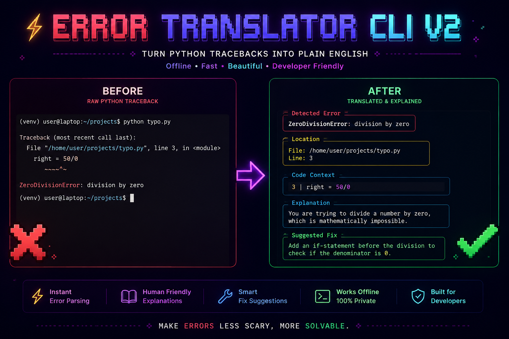

# Error Translator CLI v2

<div align="center">
  
</div>

<br>

<div align="center">
  <h3>Deterministic Python Traceback Analysis and Exception Diagnostics</h3>
  <p><b>100% Offline • Sub-millisecond Execution • AST Lexical Scoping • Multi-Surface Integration</b></p>
</div>

<div align="center">
  <a href="https://pypi.org/project/error-translator-cli-v2/"></a>
  
  <a href="https://github.com/gourabanandad/error-translator-cli-v2"></a>
  <a href="https://github.com/gourabanandad/error-translator-cli-v2/actions/workflows/ci.yml"></a>
</div>

<br>

---

## What is Error Translator?

**Error Translator** is a local-first Python traceback analyzer and exception explainer. It parses raw Python stack traces, retrieves the offending source line, inspects surrounding Abstract Syntax Tree (AST) lexical scopes for typo resolution, and converts exceptions into **structured explanations** paired with **concrete remediation steps**.

Designed for developers, educators, and automated CI pipelines, it operates **entirely offline** with **zero telemetry** and sub-millisecond execution speeds.

```text
RAW PYTHON EXCEPTION:
Traceback (most recent call last):
  File "calculator.py", line 12, in <module>
    result = "Total items: " + count
TypeError: can only concatenate str (not "int") to str

ERROR TRANSLATOR DIAGNOSTIC:
┌─ Detected Error ─────────────────────────────────────────────────────────────┐
│ TypeError: can only concatenate str (not "int") to str                       │
├─ Location ───────────────────────────────────────────────────────────────────┤
│ File: calculator.py  |  Line: 12                                             │
├─ Code Context ───────────────────────────────────────────────────────────────┤
│ 12 │ result = "Total items: " + count                                        │
├─ Explanation ────────────────────────────────────────────────────────────────┤
│ You are trying to add a string to an int, which Python cannot do.            │
├─ Suggested Fix ──────────────────────────────────────────────────────────────┤
│ Convert the int to a string first using str() before concatenating.          │
└──────────────────────────────────────────────────────────────────────────────┘
```

---

## Core Pillars & Design Principles

=== "Offline & Local Execution"
    **Zero Network Latency & Total Privacy.**
    
    Source code, file paths, variable names, and crash logs remain local to your workstation. All regex evaluations and AST traversals run on the local CPU without external network requests or cloud dependencies.

=== "Sub-Millisecond Speed"
    **Dual-Engine Architecture.**
    
    Powered by an optional compiled C extension (`fast_matcher.c`) that accelerates pattern matching across pre-compiled regex tables. On systems without a C compiler, it automatically and transparently falls back to a pure-Python matching loop with zero difference in output.

=== "Lexical Scope AST Intelligence"
    **Context-Aware Diagnostics.**
    
    When a `NameError`, `AttributeError`, or `ImportError` occurs, the engine parses the Python file into an Abstract Syntax Tree (AST). By analyzing `lineno` and `end_lineno` boundaries, it searches for similar identifiers strictly within the visible scope—offering precise suggestions without false positives.

=== "Multi-Surface Integration"
    **Flexible Tooling Across Environments.**
    
    Use Error Translator across the development lifecycle:
    
    1. **Command-Line Tool (`explain-error`)** for running scripts, analyzing logs, or starting interactive REPL sessions.
    2. **Automatic Hook (`error_translator.auto`)** for global exception interception via `sys.excepthook`.
    3. **Jupyter Notebook Extension (`%load_ext error_translator.jupyter`)** for in-cell Markdown explanations.
    4. **Programmatic Python API (`translate_error`)** for custom loggers, bots, and test fixtures.
    5. **FastAPI Microservice (`error_translator.api.server`)** for distributed log pipelines and browser-based dashboards.

---

## Quickstart

### Installation

Error Translator requires Python 3.9 or newer.

=== "Standard Pip"
    ```bash
    pip install error-translator-cli-v2
    ```

=== "With Jupyter Extension"
    ```bash
    pip install "error-translator-cli-v2[jupyter]"
    ```

=== "With FastAPI Server"
    ```bash
    pip install "error-translator-cli-v2[server]"
    ```

=== "All Dependencies"
    ```bash
    pip install "error-translator-cli-v2[server,jupyter,dev,docs]"
    ```

---

### Usage Modes

=== "1. Run a Script"
    Run any Python script directly. If it fails, the error output is intercepted and translated:
    ```bash
    explain-error run my_script.py
    ```

=== "2. Direct Error Text"
    Paste error text directly as CLI arguments:
    ```bash
    explain-error "NameError: name 'usr_count' is not defined"
    ```

=== "3. Pipe Logs (Stdin)"
    Stream standard input from Docker, CI logs, or files:
    ```bash
    cat crash.log | explain-error
    ```

=== "4. Interactive REPL"
    Launch a continuous interactive translation shell:
    ```bash
    explain-error interactive
    ```

=== "5. Python Import Hook"
    Add one import at the top of your script for automatic crash translation:
    ```python
    import error_translator.auto

    # Your code here...
    ```

=== "6. Jupyter Notebook"
    Load the IPython extension inside any notebook cell:
    ```python
    %load_ext error_translator.jupyter
    ```

---

## Explore the Documentation

<div class="grid cards" markdown>

-   :material-layers-triple: [__Features & Integrations__](features.md)

    ---

    Detailed reference guides for CLI execution, REPL mode, Jupyter notebooks, FastAPI REST endpoints, and the programmatic Python API.

-   :material-cogs: [__Architecture & Internals__](ARCHITECTURE.md)

    ---

    In-depth architectural overview, mermaid pipeline flowcharts, C-extension design, AST scoping mechanics, and schema contracts.

-   :material-book-open-page-variant: [__Real-World Examples__](examples.md)

    ---

    Curated catalog of raw tracebacks alongside translated output panels across all 26+ Python exception classes.

-   :material-source-pull: [__Contributing Guide__](CONTRIBUTING.md)

    ---

    Contribution standards, local setup with `pytest`, adding regex patterns to `rules.json`, and using the AI-Powered Rule Builder.

</div>

---

## Search Index & Covered Topics

- **Traceback & Error Parsing**: Python error translator, stack trace parser, traceback interpreter, terminal error explanation, offline debugging tool.
- **Common Python Exceptions**: `TypeError`, `ValueError`, `NameError`, `AttributeError`, `IndexError`, `KeyError`, `FileNotFoundError`, `ZeroDivisionError`, `ModuleNotFoundError`, `SyntaxError`, `IndentationError`, `RecursionError`.
- **Lexical AST Analysis**: AST scope boundaries, fuzzy identifier matching with `difflib`, variable typo suggestions, method name correction.
- **Integration Points**: CLI (`explain-error`), REPL interactive shell, global `sys.excepthook` interceptor, Jupyter / IPython notebook magic (`%load_ext`), FastAPI REST API service.

---

## Community & Support

- **Repository**: [GitHub (gourabanandad/error-translator-cli-v2)](https://github.com/gourabanandad/error-translator-cli-v2)
- **PyPI Package**: [error-translator-cli-v2](https://pypi.org/project/error-translator-cli-v2/)
- **Bug Reports & Issues**: [GitHub Issues](https://github.com/gourabanandad/error-translator-cli-v2/issues)
- **License**: [MIT License](https://opensource.org/licenses/MIT)
